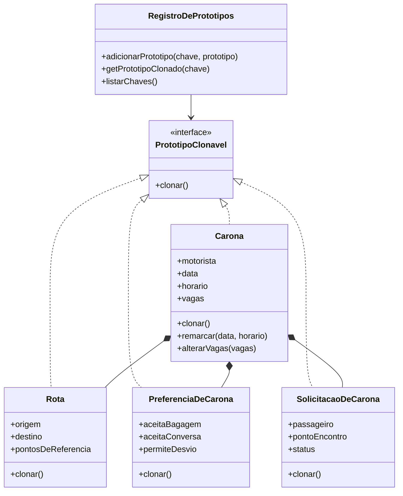

# Padrão de Projeto - Prototype

## Introdução

_Resumo breve do que é o padrão e por que ele é relevante no Carona Amiga FCTE._

## Objetivos

O objetivo do padrão Prototype é permitir a criação de novos objetos a partir da cópia de um objeto já existente, chamado de protótipo. Em vez de construir uma nova instância do zero, repetindo todos os parâmetros, configurações e regras de inicialização, o sistema solicita que o próprio objeto original gere uma cópia de si, normalmente por meio de um método de clonagem.

Essa cópia nasce com o mesmo estado inicial do protótipo e, depois disso, pode ter apenas os dados necessários alterados. No contexto do Carona Amiga FCTE, isso pode ser útil para reaproveitar estruturas semelhantes, como modelos de carona, preferências de usuário, rotas recorrentes ou solicitações com dados parecidos, evitando repetição na criação dos objetos e reduzindo o acoplamento com classes concretas.

## Metodologia

_Explicar, em alto nível, como o conteúdo foi produzido e quais artefatos do projeto serviram de base._

## Explicação do Padrão

### Intenção

O padrão Prototype tem como intenção criar novos objetos por meio da cópia de objetos já existentes. Esses objetos existentes funcionam como modelos, também chamados de protótipos, e oferecem um método de clonagem responsável por gerar uma nova instância com os mesmos dados iniciais.

No Carona Amiga FCTE, essa ideia foi aplicada ao cenário de caronas recorrentes. Em vez de cadastrar novamente todos os dados de uma carona parecida, como motorista, rota, horário, vagas e preferências, o sistema pode clonar uma carona modelo e alterar apenas os campos necessários, como data, horário ou quantidade de vagas.

### Motivação

No domínio do Carona Amiga FCTE, algumas informações podem se repetir com frequência. Um motorista pode oferecer uma carona parecida toda semana, uma rota pode ser reutilizada em diferentes horários e preferências de carona podem seguir um mesmo padrão para vários cadastros.

Sem o Prototype, cada nova carona semelhante exigiria a criação manual de todos os seus dados. Isso aumenta repetição de código, amplia a chance de erro e deixa a criação de objetos mais dependente das classes concretas. Com o Prototype, o sistema reaproveita um objeto pronto como base, cria uma cópia independente e permite que apenas os dados específicos sejam modificados.

### Aplicabilidade

O padrão Prototype faz sentido no Carona Amiga FCTE quando:

- existem objetos com muitos atributos que seriam trabalhosos de recriar manualmente;
- o sistema precisa criar caronas semelhantes a partir de modelos recorrentes;
- preferências, rotas ou solicitações podem ser reaproveitadas como base para novos objetos;
- a criação direta com construtores deixaria o código repetitivo;
- o cliente precisa criar objetos sem conhecer todos os detalhes internos das classes concretas.

Neste artefato, o padrão foi aplicado aos domínios `Carona`, `PreferenciaDeCarona`, `SolicitacaoDeCarona` e `Rota`, com foco principal na clonagem de uma carona recorrente.

### Participantes

- **Prototype:** define o contrato de clonagem. Na implementação, esse papel é representado pela interface `PrototipoClonavel`.
- **ConcretePrototype:** representa as classes que sabem criar cópias de si mesmas. No projeto, esse papel é exercido por `Carona`, `PreferenciaDeCarona`, `SolicitacaoDeCarona` e `Rota`.
- **Registry:** armazena objetos modelo associados a chaves textuais. No projeto, esse papel é representado por `RegistroDePrototipos`.
- **Client:** solicita clones ao registro e altera apenas os dados necessários. Na implementação ilustrativa, esse papel aparece em `main.ts`.

### Colaborações

O cliente não instancia uma carona recorrente preenchendo todos os campos manualmente. Primeiro, ele consulta o `RegistroDePrototipos` por uma chave, como `CARONA_RECORRENTE_FCTE`. Em seguida, o registro encontra o objeto modelo correspondente e chama seu método `clonar()`.

A classe concreta, como `Carona`, é responsável por criar uma nova instância com os mesmos dados do protótipo. Depois que o clone é gerado, o cliente pode alterar informações específicas sem modificar o objeto original guardado no registro.

### Consequências

O uso do Prototype no Carona Amiga FCTE traz os seguintes benefícios:

- reduz a repetição na criação de objetos semelhantes;
- facilita a criação de caronas recorrentes;
- permite reaproveitar rotas, preferências e solicitações como modelos;
- diminui o acoplamento entre o cliente e as classes concretas;
- mantém o objeto original preservado enquanto o clone pode ser modificado.

Também existem cuidados importantes:

- a clonagem precisa ser implementada corretamente para evitar compartilhamento indevido de dados internos;
- objetos compostos, como `Carona`, exigem atenção porque possuem outros objetos dentro deles;
- se o clone copiar dados que deveriam ser únicos, como identificadores finais de banco de dados, esses dados precisam ser ajustados após a clonagem;
- quando há listas ou objetos internos, deve-se avaliar se a cópia será rasa ou profunda.

Na implementação deste artefato, a classe `Carona` realiza uma cópia mais segura de seus objetos internos, clonando também `Rota`, `PreferenciaDeCarona` e cada `SolicitacaoDeCarona`.

### Implementação

A implementação foi organizada em TypeScript dentro da pasta `src`, mantendo apenas o arquivo principal de teste e as classes de protótipo usadas no exemplo.

Estrutura criada:

```text
docs/PadroesDeProjeto/3.1. Criacionais/src/
  main.ts
  prototipos/
    PrototipoClonavel.ts
    Carona.ts
    PreferenciaDeCarona.ts
    SolicitacaoDeCarona.ts
    Rota.ts
    RegistroDePrototipos.ts
```

#### Interface PrototipoClonavel

A interface `PrototipoClonavel` define que toda classe participante do padrão deve possuir um método `clonar()`. Esse método é o ponto central do Prototype, pois transfere para o próprio objeto a responsabilidade de gerar sua cópia.

<details>
  <summary><strong>Código para `PrototipoClonavel.ts`</strong></summary>

```typescript
export interface PrototipoClonavel<T> {
  clonar(): T;
}
```

</details>

#### Classe Rota

A classe `Rota` representa o trajeto de uma carona. Ela possui origem, destino e pontos de referência. Ao clonar uma rota, a lista de pontos de referência também é copiada para que alterações no clone não afetem o protótipo original.

<details>
  <summary><strong>Código para `Rota.ts`</strong></summary>

```typescript
import { PrototipoClonavel } from "./PrototipoClonavel";

export class Rota implements PrototipoClonavel<Rota> {
  constructor(
    public origem: string,
    public destino: string,
    public pontosDeReferencia: string[] = []
  ) {}

  clonar(): Rota {
    return new Rota(this.origem, this.destino, [...this.pontosDeReferencia]);
  }
}
```

</details>

#### Classe PreferenciaDeCarona

A classe `PreferenciaDeCarona` concentra regras e preferências associadas à carona, como aceitar bagagem, conversa ou desvios. Ela pode ser usada como modelo para evitar que as mesmas preferências sejam configuradas repetidamente.

<details>
  <summary><strong>Código para `PreferenciaDeCarona.ts`</strong></summary>

```typescript
import { PrototipoClonavel } from "./PrototipoClonavel";

export class PreferenciaDeCarona
  implements PrototipoClonavel<PreferenciaDeCarona>
{
  constructor(
    public aceitaBagagem: boolean,
    public aceitaConversa: boolean,
    public permiteDesvio: boolean,
    public observacoes: string
  ) {}

  clonar(): PreferenciaDeCarona {
    return new PreferenciaDeCarona(
      this.aceitaBagagem,
      this.aceitaConversa,
      this.permiteDesvio,
      this.observacoes
    );
  }
}
```

</details>

#### Classe SolicitacaoDeCarona

A classe `SolicitacaoDeCarona` representa o pedido de um passageiro para participar de uma carona. Sua clonagem permite reaproveitar uma estrutura de solicitação em exemplos ou fluxos recorrentes, preservando independência entre original e cópia.

<details>
  <summary><strong>Código para `SolicitacaoDeCarona.ts`</strong></summary>

```typescript
import { PrototipoClonavel } from "./PrototipoClonavel";

export class SolicitacaoDeCarona
  implements PrototipoClonavel<SolicitacaoDeCarona>
{
  constructor(
    public passageiro: string,
    public pontoEncontro: string,
    public status: "pendente" | "aceita" | "recusada",
    public observacoes: string
  ) {}

  clonar(): SolicitacaoDeCarona {
    return new SolicitacaoDeCarona(
      this.passageiro,
      this.pontoEncontro,
      this.status,
      this.observacoes
    );
  }
}
```

</details>

#### Classe Carona

A classe `Carona` é o principal protótipo concreto deste recorte. Ela agrega `Rota`, `PreferenciaDeCarona` e uma lista de `SolicitacaoDeCarona`. Por isso, seu método `clonar()` não copia apenas os atributos simples; ele também clona os objetos internos para que o clone possa ser alterado sem afetar o modelo original.

<details>
  <summary><strong>Código para `Carona.ts`</strong></summary>

```typescript
import { PreferenciaDeCarona } from "./PreferenciaDeCarona";
import { PrototipoClonavel } from "./PrototipoClonavel";
import { Rota } from "./Rota";
import { SolicitacaoDeCarona } from "./SolicitacaoDeCarona";

export class Carona implements PrototipoClonavel<Carona> {
  constructor(
    public motorista: string,
    public rota: Rota,
    public data: string,
    public horario: string,
    public vagas: number,
    public preferencias: PreferenciaDeCarona,
    public solicitacoes: SolicitacaoDeCarona[] = []
  ) {}

  clonar(): Carona {
    return new Carona(
      this.motorista,
      this.rota.clonar(),
      this.data,
      this.horario,
      this.vagas,
      this.preferencias.clonar(),
      this.solicitacoes.map((solicitacao) => solicitacao.clonar())
    );
  }

  remarcar(data: string, horario: string): void {
    this.data = data;
    this.horario = horario;
  }

  alterarVagas(vagas: number): void {
    this.vagas = vagas;
  }

  adicionarSolicitacao(solicitacao: SolicitacaoDeCarona): void {
    this.solicitacoes.push(solicitacao);
  }

  resumo(): string {
    return `${this.motorista} | ${this.rota.origem} -> ${this.rota.destino} | ${this.data} ${this.horario} | ${this.vagas} vaga(s)`;
  }
}
```

</details>

#### Classe RegistroDePrototipos

A classe `RegistroDePrototipos` guarda objetos modelo associados a chaves. Neste artefato, as chaves principais são `CARONA_RECORRENTE_FCTE`, `CARONA_NOTURNA` e `PREFERENCIA_PADRAO`. O cliente solicita uma chave e recebe um clone do protótipo correspondente.

<details>
  <summary><strong>Código para `RegistroDePrototipos.ts`</strong></summary>

```typescript
import { PrototipoClonavel } from "./PrototipoClonavel";

export class RegistroDePrototipos {
  private readonly prototipos = new Map<string, PrototipoClonavel<unknown>>();

  adicionarPrototipo(chave: string, prototipo: PrototipoClonavel<unknown>): void {
    this.prototipos.set(chave.toUpperCase(), prototipo);
  }

  getPrototipoClonado<T>(chave: string): T | undefined {
    const prototipo = this.prototipos.get(chave.toUpperCase());

    if (!prototipo) {
      return undefined;
    }

    return prototipo.clonar() as T;
  }

  listarChaves(): string[] {
    return [...this.prototipos.keys()];
  }
}
```

</details>

#### Classe Principal de Teste

O arquivo `main.ts` demonstra a lógica de uso do padrão:

1. cria objetos modelo;
2. registra os protótipos;
3. solicita um modelo pela chave;
4. clona o objeto escolhido;
5. altera dados apenas no clone;
6. mantém o objeto original sem alteração.

<details>
  <summary><strong>Código para `main.ts`</strong></summary>

```typescript
import { Carona } from "./prototipos/Carona";
import { PreferenciaDeCarona } from "./prototipos/PreferenciaDeCarona";
import { RegistroDePrototipos } from "./prototipos/RegistroDePrototipos";
import { Rota } from "./prototipos/Rota";
import { SolicitacaoDeCarona } from "./prototipos/SolicitacaoDeCarona";

const registro = new RegistroDePrototipos();

const preferenciaPadrao = new PreferenciaDeCarona(
  true,
  true,
  false,
  "Preferencias padrao para caronas entre estudantes da FCTE."
);

const caronaRecorrenteFcte = new Carona(
  "Motorista FCTE",
  new Rota("Campus FCTE", "Asa Norte", ["Parada central", "Eixinho"]),
  "2026-05-22",
  "18:00",
  3,
  preferenciaPadrao,
  [
    new SolicitacaoDeCarona(
      "Passageiro exemplo",
      "Entrada principal da FCTE",
      "pendente",
      "Solicitacao criada como parte do modelo."
    ),
  ]
);

const caronaNoturna = new Carona(
  "Motorista noturno",
  new Rota("Campus FCTE", "Taguatinga", ["Biblioteca", "Metro"]),
  "2026-05-22",
  "22:10",
  2,
  new PreferenciaDeCarona(
    false,
    false,
    false,
    "Modelo para deslocamentos noturnos, com rota mais direta."
  )
);

registro.adicionarPrototipo("CARONA_RECORRENTE_FCTE", caronaRecorrenteFcte);
registro.adicionarPrototipo("CARONA_NOTURNA", caronaNoturna);
registro.adicionarPrototipo("PREFERENCIA_PADRAO", preferenciaPadrao);

console.log("Prototipos cadastrados:", registro.listarChaves());

const cloneDaCarona = registro.getPrototipoClonado<Carona>(
  "CARONA_RECORRENTE_FCTE"
);

if (cloneDaCarona) {
  cloneDaCarona.remarcar("2026-05-29", "18:30");
  cloneDaCarona.alterarVagas(1);
  cloneDaCarona.adicionarSolicitacao(
    new SolicitacaoDeCarona(
      "Novo passageiro",
      "Bloco de aulas",
      "pendente",
      "Solicitacao adicionada apenas ao clone."
    )
  );

  console.log("Original:", caronaRecorrenteFcte.resumo());
  console.log("Clone alterado:", cloneDaCarona.resumo());
  console.log("Solicitacoes no original:", caronaRecorrenteFcte.solicitacoes.length);
  console.log("Solicitacoes no clone:", cloneDaCarona.solicitacoes.length);
}
```

</details>

### Padrões Relacionados

O Prototype se relaciona com outros padrões criacionais, principalmente:

- **Factory Method:** também centraliza a criação de objetos, mas cria novas instâncias por meio de métodos de fábrica, não por clonagem de modelos existentes.
- **Builder:** ajuda a construir objetos complexos passo a passo, enquanto o Prototype parte de um objeto já configurado e gera cópias dele.
- **Abstract Factory:** pode ser usado para criar famílias de objetos relacionados, enquanto o Prototype é mais indicado quando o sistema possui objetos modelo que podem ser duplicados.

## Recorte do Projeto e TOI Ilustrativo

O recorte escolhido para o Carona Amiga FCTE foi a criação de caronas recorrentes. A classe central é `Carona`, que concentra informações como motorista, rota, data, horário, vagas, preferências e solicitações. O padrão Prototype permite que uma carona modelo seja clonada e ajustada para uma nova data, novo horário ou nova quantidade de vagas.

TOI ilustrativo:



## Conclusão

O padrão Prototype se encaixa no Carona Amiga FCTE como uma solução criacional adequada para reaproveitar objetos configurados previamente, principalmente em cenários de caronas recorrentes. A implementação proposta mostra que uma carona modelo pode ser registrada, clonada e modificada sem alterar o protótipo original.

Com isso, o sistema reduz repetição na criação de objetos, melhora a organização da lógica de instanciação e mantém maior flexibilidade para trabalhar com rotas, preferências e solicitações semelhantes. O cuidado principal está em garantir que objetos internos também sejam clonados quando necessário, evitando que o clone compartilhe dados mutáveis com o modelo original.

## Referências Bibliográficas

> <a id="ref1"></a> REFACTORING GURU. **Prototype**. Disponível em: <https://refactoring.guru/pt-br/design-patterns/prototype>. Acesso em: 19 maio 2026.

> <a id="ref2"></a> MOREIRA, Diogo. **Padrão Prototype**. Disponível em: <https://diogomoreira.gitbook.io/padroes-de-projeto/padroes-gof-criacionais/padrao-prototype>. Acesso em: 19 maio 2026.

## Histórico de Versões

| Versão |    Data    | Descrição | Autor(es) | Revisor(es) | Detalhes da revisão |
| :----: | :--------: | --------- | --------- | ----------- | :-----------------: |
|  1.0   | 19/05/2026 | Adição dos objetivos e referências | [Karoline Luz da Conceição](https://github.com/KarolineLuz) | [Ana Victória Guedes da Costa](https://github.com/navicg) | Revisão das seções adicionadas ao artefato |
|  1.1   | 19/05/2026 | Documentação da explicação, modelagem e implementação em TypeScript | [Karoline Luz da Conceição](https://github.com/KarolineLuz) | [Ana Victória Guedes da Costa](https://github.com/navicg) | Revisão da aplicação do Prototype no domínio de caronas recorrentes |
