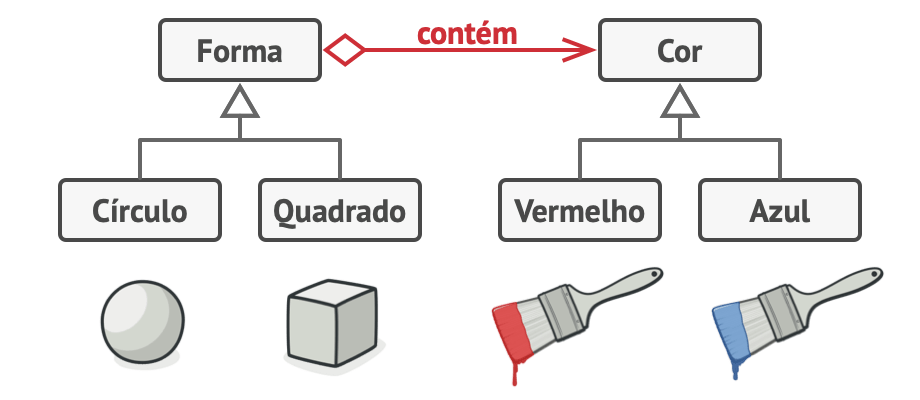
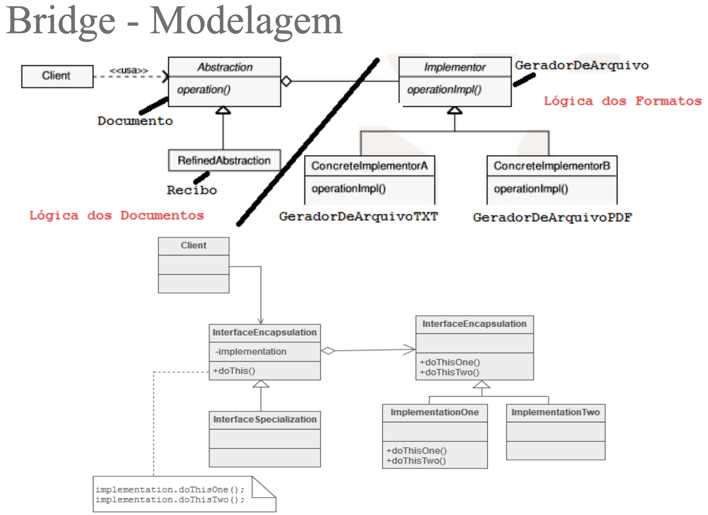
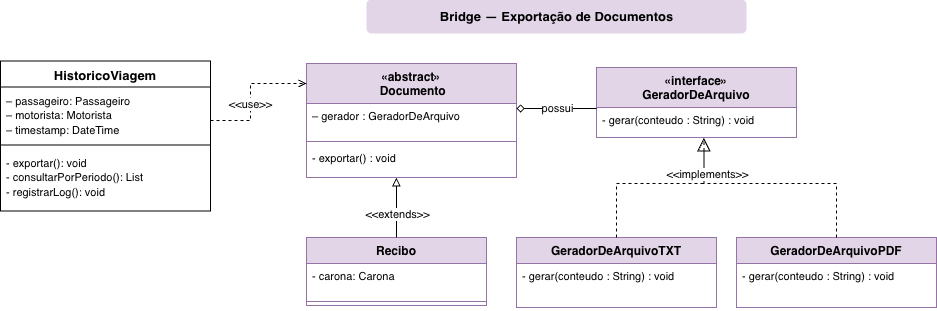

# Padrão de Projeto - Bridge

## Introdução

O **Bridge** é um padrão de projeto estrutural que permite dividir uma classe grande (ou um conjunto de classes muito acopladas) em duas hierarquias separadas — **abstração** e **implementação** — que podem ser desenvolvidas de forma independente [[1]](#ref1).

No contexto do **Carona Amiga FCTE**, esse padrão é útil quando uma funcionalidade precisa variar em **duas dimensões** ao mesmo tempo. Neste documento, o recorte escolhido é a **exportação de documentos** relacionados ao **Histórico de Viagem** (por exemplo, gerar um **Recibo** em diferentes formatos como TXT e PDF), evitando uma explosão de subclasses do tipo `ReciboPDF`, `ReciboTXT`, etc.

## Objetivos

Este artefato tem como finalidade:

- Explicar o padrão **Bridge**, descrevendo intenção, motivação, aplicabilidade, participantes, colaborações e consequências;
- Relacionar o padrão ao domínio do **Carona Amiga FCTE**, indicando um **recorte do projeto** onde ele se encaixa;
- Apresentar um **diagrama UML** do recorte escolhido, para guiar modelagem/implementação.

## Metodologia

Como ponto de partida, foi utilizada a discussão registrada na [Ata 1](../3.5.IniciativasExtras/ata1.md) (com gravação da reunião: https://youtu.be/y6FIosTab0s).

1. Foi consultada a descrição do padrão **Bridge** no Refactoring.Guru [[1]](#ref1) e exemplos de implementação em TypeScript [[2]](#ref2).

2. Para o recorte do projeto, foram consideradas as necessidades do domínio do **Carona Amiga FCTE** (um web app que conecta motoristas e passageiros) e a organização de artefatos da entrega, em especial o [Diagrama de Classes](https://unbarqdsw2026-1-turma02.github.io/2026.1-T02-G7_CaronaAmigaFCTE_Entrega_02/#/Modelagem/2.1.ModelagemEstatica/Diagrama_de_classes).

3. A partir disso, foi proposto um recorte coerente (exportação de documentos do **Histórico de Viagem**) e elaborado um **diagrama UML** com papéis e relacionamentos típicos do Bridge.

4. Os artefatos deste documento e o diagrama UML foram desenvolvidos ao utilizar o **Visual Studio Code (VSCode)** como IDE principal.

---

## Explicação do Padrão

### Intenção
Separar o que é **abstração** (o “o quê” o sistema oferece) do que é **implementação** (o “como” isso é realizado), reduzindo acoplamento e evitando explosão de subclasses quando existem duas dimensões de variação [[1]](#ref1).

### Motivação
Um sintoma comum que motiva o Bridge é quando um time começa com uma hierarquia simples e, conforme surgem novas variações, aparecem combinações do tipo [[1]](#ref1):

- `ReciboTXT`
- `ReciboPDF`
- `RelatorioTXT`
- `RelatorioPDF`

Esse crescimento é **combinatório**: para cada novo *tipo de documento* e para cada novo *formato/gerador*, o número de classes aumenta rapidamente.

No **Carona Amiga FCTE**, isso pode acontecer ao evoluir a parte de **Histórico de Viagem**: o sistema pode precisar exportar um **Recibo** (ou outros documentos) em múltiplos formatos. O Bridge evita que a regra de negócio (o que o documento representa) fique acoplada ao detalhe de infraestrutura/saída (como o arquivo é gerado).

Para ilustrar o problema e a solução, o Refactoring.Guru usa um exemplo clássico: ao tentar variar uma hierarquia por **duas dimensões** (por exemplo, *forma* e *cor*), a herança gera uma explosão de combinações (como `CirculoAzul`, `QuadradoVermelho`, etc.). A proposta do Bridge é extrair uma dessas dimensões para uma hierarquia separada e ligar as duas via **composição**, permitindo evoluir cada lado independentemente [[1]](#ref1).

<div align="center">
              Figura 1: Exemplo de aplicação do padrão Bridge.



<font size="2"><p style="text-align: center">Fonte: Refactoring.Guru [[1]](#ref1).</p></font>
</div>

---

<div align="center">
              Figura 2: Exemplo de aplicação do padrão Bridge.



<font size="2"><p style="text-align: center">Fonte: Serrano, Milene [[7]](#ref7).</p></font>

</div>

---

### Aplicabilidade
O Bridge faz sentido quando:

- Existem **duas (ou mais) dimensões de variação** que precisam evoluir separadamente (ex.: *tipo de documento* vs. *formato/gerador*);
- Queremos **trocar implementações em tempo de execução** (ex.: mudar o gerador/formatador de arquivo sem reescrever a lógica de negócio);
- Precisamos reduzir o acoplamento de camadas (domínio/aplicação) com detalhes de infraestrutura (geração de arquivos e integrações);
- O sistema tende a crescer e manter uma hierarquia única geraria **classes demais** ou mudanças espalhadas.

No recorte deste projeto, as dimensões são:

- **Abstração:** tipos de documentos do histórico (ex.: `Documento` → `Recibo`).
- **Implementação:** geradores de arquivo/formato (ex.: `GeradorDeArquivoTXT`, `GeradorDeArquivoPDF`).

### Participantes

<font size="3"><p style="text-align: center">Tabela 1: Participantes do Bridge</p></font>

| Papel | Responsabilidade | Exemplo no Carona Amiga FCTE |
|---|---|---|
| **Abstraction** | Define a interface de alto nível e mantém referência para a implementação | `Documento` |
| **RefinedAbstraction** | Especializa a abstração com variações do “o quê” | `Recibo` |
| **Implementor** | Define a interface de implementação | `GeradorDeArquivo` |
| **ConcreteImplementor** | Implementa detalhes concretos do “como” | `GeradorDeArquivoTXT`, `GeradorDeArquivoPDF` |

<font size="2"><p style="text-align: center">Fonte: [João Marcos Moraes de Andrade](https://github.com/JJOAOMARCOSS), [Luiza da Silva Pugas](https://github.com/luizaxx) e [Wanjo Christopher Paraizo Escobar](https://github.com/wChrstphr), com base no Refactoring.Guru [[1]](#ref1), 2026.</p></font>

---

## Recorte do Projeto e Diagrama UML

Como recorte, considera-se o **Histórico de Viagem** do Carona Amiga FCTE e a necessidade de **exportar documentos** relacionados a uma carona já realizada (por exemplo, um **Recibo**). O mesmo documento pode ser exportado em formatos diferentes (TXT/PDF), e novos formatos podem ser adicionados ao longo do projeto.

<div align="center">
              Figura 3: Diagrama UML do Bridge no recorte do módulo.



<font size="2"><p style="text-align: center">Fonte: [João Marcos Moraes de Andrade](https://github.com/JJOAOMARCOSS),  [Luiza da Silva Pugas](https://github.com/luizaxx) e [Wanjo Christopher Paraizo Escobar](https://github.com/wChrstphr), 2026.</p></font>
</div>

---

## Vídeo de explicação e execução

<iframe width="1321" height="743" src="https://www.youtube.com/embed/6h8a_KX_Igg" frameborder="0" allow="accelerometer; autoplay; clipboard-write; encrypted-media; gyroscope; picture-in-picture; web-share" referrerpolicy="strict-origin-when-cross-origin" allowfullscreen></iframe>

<p style="text-align: center"><a href="https://youtu.be/6h8a_KX_Igg" target="_blank">Clique aqui para assistir no YouTube</a></p>

<font size="2"><p style="text-align: center">Fonte: [João Marcos Moraes de Andrade](https://github.com/JJOAOMARCOSS),  [Luiza da Silva Pugas](https://github.com/luizaxx) e [Wanjo Christopher Paraizo Escobar](https://github.com/wChrstphr), 2026.</p></font>

---

<iframe width="1321" height="743" src="https://www.youtube.com/embed/" frameborder="0" allow="accelerometer; autoplay; clipboard-write; encrypted-media; gyroscope; picture-in-picture; web-share" referrerpolicy="strict-origin-when-cross-origin" allowfullscreen></iframe>

<p style="text-align: center"><a href="https://youtu.be/" target="_blank">Clique aqui para assistir no YouTube</a></p>

<font size="2"><p style="text-align: center">Fonte: [João Marcos Moraes de Andrade](https://github.com/JJOAOMARCOSS),  [Luiza da Silva Pugas](https://github.com/luizaxx) e [Wanjo Christopher Paraizo Escobar](https://github.com/wChrstphr), 2026.</p></font>

---

## Código (TypeScript)

<details>
  <summary><strong>Código para Bridge (Documento/Recibo + GeradorDeArquivo)</strong></summary>

```ts
// Implementor
export interface GeradorDeArquivo {
	gerar(conteudo: string): void;
}

// ConcreteImplementors
export class GeradorDeArquivoTXT implements GeradorDeArquivo {
	public gerar(conteudo: string): void {
		// Exemplo didático: em uma app real, aqui você escreveria em arquivo/stream.
		console.log("[TXT]\n" + conteudo);
	}
}

export class GeradorDeArquivoPDF implements GeradorDeArquivo {
	public gerar(conteudo: string): void {
		// Exemplo didático: em uma app real, aqui você chamaria uma lib de PDF.
		console.log("[PDF]\n" + conteudo);
	}
}

// Abstraction
export abstract class Documento {
	protected constructor(protected readonly gerador: GeradorDeArquivo) {}

	public exportar(): void {
		const conteudo = this.gerarConteudo();
		this.gerador.gerar(conteudo);
	}

	protected abstract gerarConteudo(): string;
}

// Tipos do domínio (simplificados para o exemplo)
export type Carona = {
	id: string;
	data: string;
	origem: string;
	destino: string;
	valor: number;
};

// RefinedAbstraction
export class Recibo extends Documento {
	public constructor(
		gerador: GeradorDeArquivo,
		private readonly carona: Carona,
	) {
		super(gerador);
	}

	protected gerarConteudo(): string {
		return [
			"Recibo de Viagem",
			`Carona: ${this.carona.id}`,
			`Data: ${this.carona.data}`,
			`Origem: ${this.carona.origem}`,
			`Destino: ${this.carona.destino}`,
			`Valor: R$ ${this.carona.valor.toFixed(2)}`,
		].join("\n");
	}
}

// Exemplo de uso
const carona: Carona = {
	id: "C-1024",
	data: "2026-05-15",
	origem: "FCTE",
	destino: "Rodoviária",
	valor: 12.5,
};

new Recibo(new GeradorDeArquivoTXT(), carona).exportar();
new Recibo(new GeradorDeArquivoPDF(), carona).exportar();
```

</details>

---

## Conclusão
O padrão **Bridge** contribui para manter o Carona Amiga FCTE evolutivo ao separar **regras/abstrações** de **detalhes de implementação**, principalmente em funcionalidades com duas dimensões de variação. No recorte de **Histórico de Viagem**, ele evita a explosão de subclasses ao exportar documentos (ex.: Recibo) em múltiplos formatos e permite que o sistema cresça adicionando novos tipos de documentos e novos geradores/formatos de arquivo de forma independente.

## Referências Bibliográficas
> <a id="ref1"></a>1. Refactoring.Guru. *Bridge (Design Pattern)*. Disponível em: https://refactoring.guru/design-patterns/bridge. Acesso em: 15 mai. 2026.
>
> <a id="ref2"></a>2. Refactoring.Guru. *Bridge in TypeScript (Example)*. Disponível em: https://refactoring.guru/design-patterns/bridge/typescript/example. Acesso em: 15 mai. 2026.
>
> <a id="ref3"></a>3. SourceMaking. *Bridge Design Pattern in Java — Example 1*. Disponível em: https://sourcemaking.com/design_patterns/bridge/java/1. Acesso em: 15 mai. 2026.
>
> <a id="ref4"></a>4. SourceMaking. *Bridge Design Pattern in Java — Example 2*. Disponível em: https://sourcemaking.com/design_patterns/bridge/java/2. Acesso em: 15 mai. 2026.
>
> <a id="ref5"></a>5. SourceMaking. *Bridge Design Pattern in Java — Example 3*. Disponível em: https://sourcemaking.com/design_patterns/bridge/java/3. Acesso em: 15 mai. 2026.
>
> <a id="ref6"></a>6. GAMMA, Erich; HELM, Richard; JOHNSON, Ralph; VLISSIDES, John. *Design Patterns: Elements of Reusable Object-Oriented Software*. Addison-Wesley, 1994.
>
> <a id="ref7"></a>7. SERRANO, Milene. *Arquitetura e Desenho de Software — Aula GoFs Estruturais*. Slides da disciplina. Disponível em: https://aprender3.unb.br/pluginfile.php/3296210/mod_page/content/1/Arquitetura%20e%20Desenho%20de%20Software%20-%20Aula%20GoFs%20Estruturais%20-%20Profa.%20Milene.pdf. Acesso em: 15 mai. 2026.

---

## Histórico de Versões

| Versão | Data | Descrição | Autor(es) | Revisor(es) | Detalhes da revisão |
| :----: | :--: | --------- | ----------- | ------ | :---: |
| 1.0 | 15/05/2026 | Criação do esqueleto do documento | [João Marcos Moraes de Andrade](https://github.com/JJOAOMARCOSS) | [Wanjo Christopher Paraizo Escobar](https://github.com/wChrstphr) | Estrutura básica com as seções principais |
| 1.1 | 15/05/2026 | Preenchimento do conteúdo do padrão Bridge | [João Marcos Moraes de Andrade](https://github.com/JJOAOMARCOSS) | [Luiza da Silva Pugas](https://github.com/luizaxx) | Revisão de texto, referências e diagrama UML |
| 1.2 | 18/05/2026 | Adição do vídeo explicativo e da img do UML | [João Marcos Moraes de Andrade](https://github.com/JJOAOMARCOSS) | [Wanjo Christopher Paraizo Escobar](https://github.com/wChrstphr) e [Luiza da Silva Pugas](https://github.com/luizaxx) | Adição do implements no uml |
