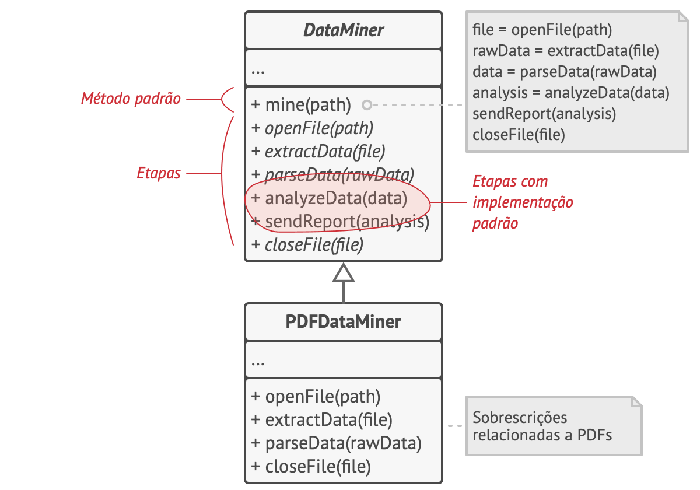
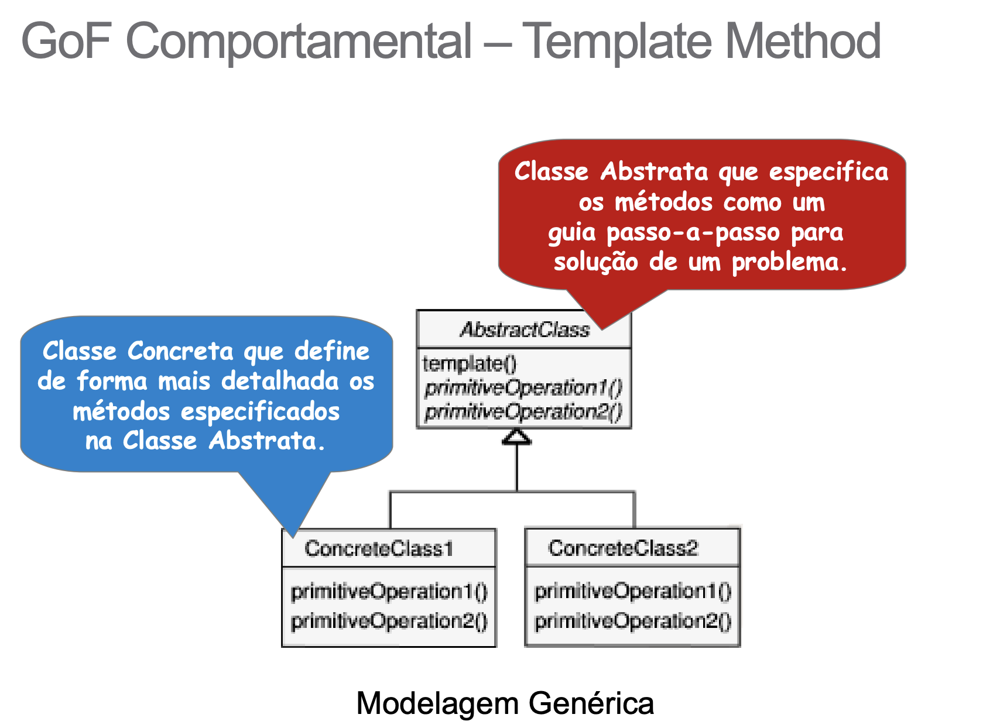
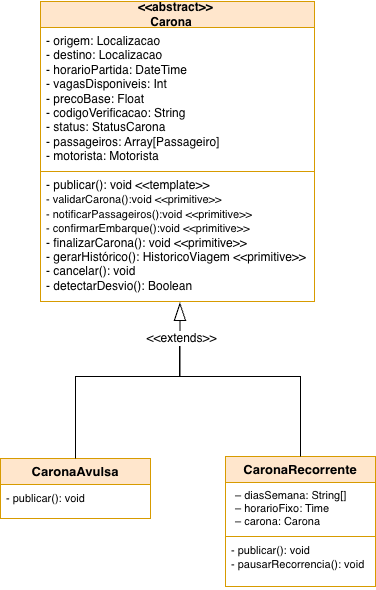

# Padrão de Projeto - Template Method

## Introdução

O **Template Method** é um padrão de projeto comportamental que define o esqueleto de um algoritmo na superclasse e permite que subclasses sobrescrevam etapas específicas sem modificar a estrutura do algoritmo [[1]](#ref1).

No contexto do **Carona Amiga FCTE**, o padrão se encaixa bem na publicação de caronas com modalidades diferentes (ex.: **avulsa** e **recorrente**): as modalidades compartilham o mesmo fluxo geral, mas diferem em regras de validação, notificação e confirmação.

## Objetivos

- Documentar a aplicação do padrão **Template Method** no projeto.
- Descrever os participantes do padrão e o mapeamento para classes do domínio.
- Apresentar um recorte do diagrama que evidencia a estrutura do padrão.
- Registrar consequências (benefícios e custos) da adoção do padrão.

## Metodologia

Como ponto de partida, foi utilizada a discussão registrada na [Ata 1](../3.5.IniciativasExtras/ata1.md) (com gravação da reunião: https://youtu.be/y6FIosTab0s).

1. Foi consultada a descrição do padrão **Template Method** no Refactoring.Guru [[1]](#ref1).
2. Foi analisado o [Diagrama de Classes](https://unbarqdsw2026-1-turma02.github.io/2026.1-T02-G7_CaronaAmigaFCTE_Entrega_02/#/Modelagem/2.1.ModelagemEstatica/Diagrama_de_classes) no recorte da hierarquia `Carona` → `CaronaAvulsa`/`CaronaRecorrente`.
3. Foi relacionado o recorte aos requisitos de publicação de carona (ex.: RF06) e às necessidades do domínio.
4. Foi elaborado um exemplo de implementação em TypeScript para guiar a implementação no código.

---

## Explicação do Padrão

### Intenção
Separar o que é fixo (o **esqueleto** do algoritmo) do que varia (as **etapas primitivas**), permitindo extensão por herança com polimorfismo [[1]](#ref1).

### Motivação
Publicar uma carona tende a seguir sempre uma sequência (validar → notificar → confirmar → finalizar → gerar histórico), mas as regras mudam de acordo com a modalidade.

Sem Template Method, a tendência é concentrar tudo em um único método cheio de condicionais por tipo de carona, o que aumenta acoplamento e dificulta manutenção.

## Ilustração do Padrão
<div align="center">
              Figura 1: Exemplo de aplicação do padrão Method Template aplicado ao Carona Amiga FCTE.


<font size="2"><p style="text-align: center">Fonte: Imagem gerada por [Claude AI](https://claude.ai/new)</p></font>
</div>

---

<div align="center">
              Figura 2: Exemplo de aplicação do padrão Template Method.



<font size="2"><p style="text-align: center">Fonte: Refactoring.Guru [[1]](#ref1).</p></font>
</div>

---

<div align="center">
              Figura 3: Exemplo de aplicação do padrão Template Method.



<font size="2"><p style="text-align: center">Fonte: Serrano, Milene [[4]](#ref4).</p></font>

</div>

---

### Aplicabilidade
Use Template Method quando:

- existe um fluxo principal que deve manter a ordem das etapas;
- algumas etapas variam por modalidade;
- novas modalidades devem ser adicionadas sem editar o algoritmo principal.

### Participantes

<font size="3"><p style="text-align: center">Tabela 1: Participantes do Template Method</p></font>

| Papel | Responsabilidade | Exemplo no Carona Amiga FCTE |
|---|---|---|
| **AbstractClass** | Define `publicar()` e declara os passos primitivos | `Carona` |
| **ConcreteClass** | Implementa os passos primitivos | `CaronaAvulsa`, `CaronaRecorrente` |
| **Client** | Usa o algoritmo via tipo abstrato | `Motorista`/Camada de aplicação |

## Recorte do Projeto e Diagrama UML

O recorte proposto é a publicação de caronas:

- `Carona` (abstrata) concentra o algoritmo `publicar()`.
- `CaronaAvulsa` e `CaronaRecorrente` implementam as etapas primitivas.

<div align="center">
              Figura 4: Diagrama UML do Template Method no recorte do módulo.



<font size="2"><p style="text-align: center">Fonte: [João Marcos Moraes de Andrade](https://github.com/JJOAOMARCOSS),  [Luiza da Silva Pugas](https://github.com/luizaxx) e [Wanjo Christopher Paraizo Escobar](https://github.com/wChrstphr), 2026.</p></font>
</div>

## Colaborações

- O cliente cria/obtém uma instância concreta (`CaronaAvulsa` ou `CaronaRecorrente`).
- O cliente chama `publicar()`.
- O template `publicar()` executa as etapas na ordem definida.
- Cada etapa é resolvida na implementação concreta via polimorfismo.

## Consequências

Benefícios:

- reduz duplicação: o fluxo fica em um único lugar.
- garante consistência: todas as modalidades seguem a mesma ordem.
- facilita extensão: adicionar modalidade = criar subclasse.

Custos:

- aumenta hierarquia de classes.
- mudanças no algoritmo impactam todas as modalidades.

---

## Vídeo de explicação e execução

<iframe width="1321" height="743" src="https://www.youtube.com/embed/LP3ABwEFgag" frameborder="0" allow="accelerometer; autoplay; clipboard-write; encrypted-media; gyroscope; picture-in-picture; web-share" referrerpolicy="strict-origin-when-cross-origin" allowfullscreen></iframe>

<p style="text-align: center"><a href="https://youtu.be/LP3ABwEFgag" target="_blank">Clique aqui para assistir no YouTube</a></p>

<font size="2"><p style="text-align: center">Fonte: [João Marcos Moraes de Andrade](https://github.com/JJOAOMARCOSS), [Luiza da Silva Pugas](https://github.com/luizaxx) e [Wanjo Christopher Paraizo Escobar](https://github.com/wChrstphr), 2026.</p></font>

---

<iframe width="1321" height="743" src="https://www.youtube.com/embed/" frameborder="0" allow="accelerometer; autoplay; clipboard-write; encrypted-media; gyroscope; picture-in-picture; web-share" referrerpolicy="strict-origin-when-cross-origin" allowfullscreen></iframe>

<p style="text-align: center"><a href="https://youtu.be/" target="_blank">Clique aqui para assistir no YouTube</a></p>

<font size="2"><p style="text-align: center">Fonte: [João Marcos Moraes de Andrade](https://github.com/JJOAOMARCOSS),  [Luiza da Silva Pugas](https://github.com/luizaxx) e [Wanjo Christopher Paraizo Escobar](https://github.com/wChrstphr), 2026.</p></font>

---

### Implementação

<details>
  <summary><strong>Exemplo didático do Template Method no recorte (Carona + modalidades)</strong></summary>

```ts
// AbstractClass
abstract class Carona {
  // template method
  public publicar(): void {
    this.validarCarona();
    this.notificarPassageiros();
    this.confirmarEmbarque();
    this.finalizarCarona();
    this.gerarHistorico();
  }

  protected abstract validarCarona(): void;
  protected abstract notificarPassageiros(): void;
  protected abstract confirmarEmbarque(): void;
  protected abstract finalizarCarona(): void;
  protected abstract gerarHistorico(): void;
}

// ConcreteClass
class CaronaAvulsa extends Carona {
  protected validarCarona(): void {
    // regras da carona avulsa
  }
  protected notificarPassageiros(): void {
    // notificação pontual
  }
  protected confirmarEmbarque(): void {
    // confirmação no momento do embarque
  }
  protected finalizarCarona(): void {
    // finaliza a carona
  }
  protected gerarHistorico(): void {
    // registra histórico
  }
}

class CaronaRecorrente extends Carona {
  protected validarCarona(): void {
    // regras de recorrência (dias/horários)
  }
  protected notificarPassageiros(): void {
    // notificação por ocorrência
  }
  protected confirmarEmbarque(): void {
    // confirmação por ocorrência
  }
  protected finalizarCarona(): void {
    // finaliza ocorrência
  }
  protected gerarHistorico(): void {
    // histórico por ocorrência
  }
}
```

> Observação: a implementação real no repositório está em `src/models/Carona.ts` e `src/models/CaronaAvulsa.ts`.

</details>

---

## Conclusão

O Template Method se encaixa naturalmente no domínio ao centralizar o fluxo de publicação em `Carona.publicar()` e deixar as modalidades (`CaronaAvulsa`, `CaronaRecorrente`) implementarem apenas os detalhes variáveis. Isso melhora consistência, reduz duplicação e facilita evolução do sistema.

---

## Referências Bibliográficas

> <a id="ref1"></a>1. Refactoring.Guru. *Template Method.* Disponível em: https://refactoring.guru/pt-br/design-patterns/template-method. Acesso em: maio 2026.
>
> <a id="ref2"></a>2. DevMedia. *Patterns: Template Method.* Disponível em: https://www.devmedia.com.br/patterns-template-method/18953. Acesso em: maio 2026.
>
> <a id="ref3"></a>3. GAMMA, Erich; HELM, Richard; JOHNSON, Ralph; VLISSIDES, John. *Design Patterns: Elements of Reusable Object-Oriented Software*. Addison-Wesley, 1994.
>
> <a id="ref4"></a>4. SERRANO, Milene. *Arquitetura e Desenho de Software — Aula GoFs Comportamentais*. Slides da disciplina. Disponível em: https://aprender3.unb.br. Acesso em: maio 2026.

## Histórico de Versões

| Versão | Data | Descrição | Autor(es) | Revisor(es) | Detalhes da revisão |
| :----: | :--: | --------- | ----------- | ------ | :---: |
| 1.0 | 16/05/2026 | Criação do esqueleto do documento | [Luiza da Silva Pugas](https://github.com/luizaxx) | [Wanjo Christopher Paraizo Escobar](https://github.com/wChrstphr) | Estrutura básica com as seções principais |
| 1.1 | 16/05/2026 | Preenchimento do conteúdo do padrão Template Method | [Luiza da Silva Pugas](https://github.com/luizaxx) | [João Marcos Moraes de Andrade](https://github.com/JJOAOMARCOSS) | Revisão de texto e ajustes gerais |
| 1.2 | 19/05/2026 | Padronização no estilo do Bridge + correções de referências e placeholders | [João Marcos Moraes de Andrade](https://github.com/JJOAOMARCOSS) | [Luiza da Silva Pugas](https://github.com/luizaxx) e [Wanjo Christopher Paraizo Escobar](https://github.com/wChrstphr) | Remoção de iframe vazio, código e estrutura coerentes com o recorte |